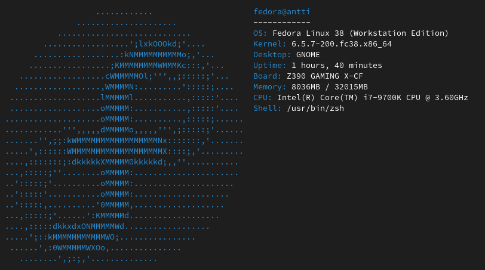
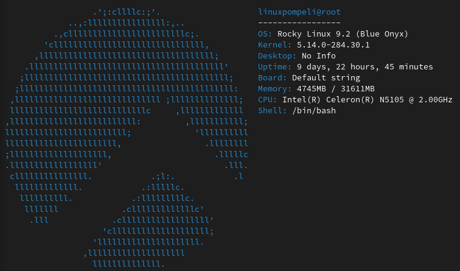

# rustsysfetch

CLI tool used to fetch system info from you Linux system. Inspired by the countless other fetch tools, like neofetch and screenfetch. 
This is project that I made mainly to learn about Rust. Since this is a learning project made for a hackathon the amount of supported OSes is low. 
Only Linux is supported and even that is limited. (This has been only tested on Fedora and Rocky Linux) Your mileage may wary. If you're looking for a real tool just get neofetch or something.
 

## Install
To install just run:  
`cargo install rustsysfetch`  
You should probably add `$HOME/.cargo/bin/` to your path.

## Usage
Just run `rustsysfetch`

## Images

## Stuff I learned:
- How to code something with Rust
- How to use cargo to publish a something in crates.io

## Todo (some day maybe):
- Use some third party packages to get system info more reliably.
- more logos

OS logos were made with [Letterpress](https://apps.gnome.org/Letterpress/)